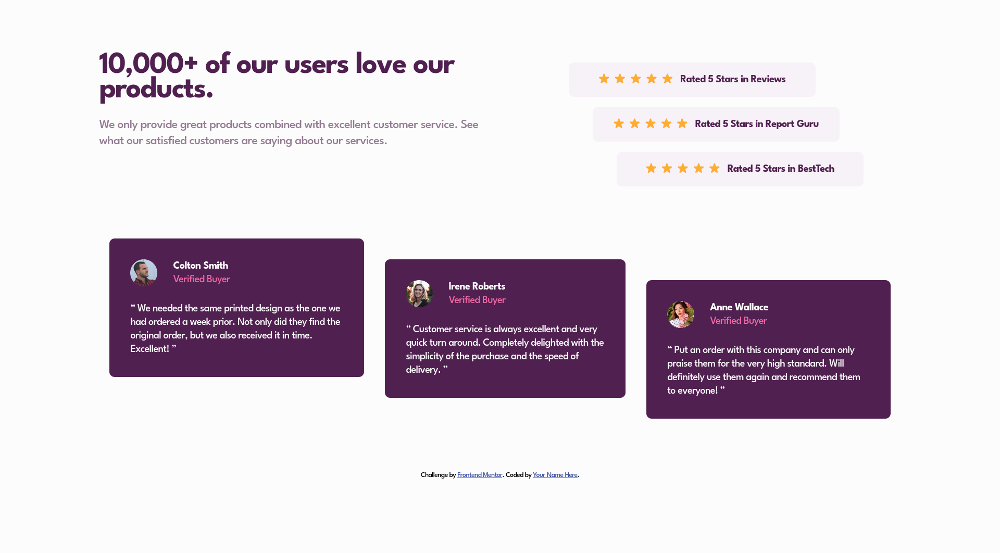
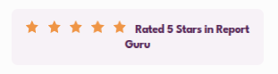

# Frontend Mentor - Social proof section solution

This is a solution to the [Social proof section challenge on Frontend Mentor](https://www.frontendmentor.io/challenges/social-proof-section-6e0qTv_bA). Frontend Mentor challenges help you improve your coding skills by building realistic projects. 

## Table of contents

- [Frontend Mentor - Social proof section solution](#frontend-mentor---social-proof-section-solution)
  - [Table of contents](#table-of-contents)
  - [Overview](#overview)
    - [The challenge](#the-challenge)
    - [Screenshot](#screenshot)
    - [Links](#links)
  - [My process](#my-process)
    - [Built with](#built-with)
    - [What I Used](#what-i-used)
      - [Star spacing](#star-spacing)
      - [Fluid staggered elements](#fluid-staggered-elements)
      - [Avoid breaking at wrong place](#avoid-breaking-at-wrong-place)
  - [Author](#author)

## Overview

### The challenge

Users should be able to:

- View the optimal layout for the section depending on their device's screen size

### Screenshot




Note that with the desktop design the top half and bottom half don't line up 
on the sides.

### Links

- Solution URL: https://github.com/tburette/frontendmentor-social-proof-section
- Live Site URL: https://tburette.github.io/frontendmentor-social-proof-section

## My process

### Built with

- Semantic HTML5 markup
- CSS custom properties
- CSS Grid
- Mobile-first workflow

### What I Used

#### Star spacing

To do the stars I originally used the unicode character (U+2B50):
```css
.rating::before {
  content: '⭐⭐⭐⭐⭐';
  letter-spacing: .5em;
}
```
It makes spacing the stars easy with letter-spacing.

I replaced it with instances of the image:
```css
content: url(images/icon-star.svg) ' ' url(images/icon-star.svg) ' ' url(images/icon-star.svg) ' ' url(images/icon-star.svg) ' ' url(images/icon-star.svg) ' ';
```
Kind of ugly looking code?

#### Fluid staggered elements

I spend quite a bit of time working on a system to fluidly stagger the ratings progressively more and more as th screen is widened. See https://gist.github.com/tburette/0beb6df36bc6b59d168f893e8b10b14b

#### Avoid breaking at wrong place

`&nbsp;` used in
```html
<p class="rating__text">Rated 5 Stars in Report&nbsp;Guru</p>
```
Avoid an ugly break in the middle of the name:



## Author

- Website - [Thomas Burette](http://thomasburette.com/)
- Frontend Mentor - [@tburette](https://www.frontendmentor.io/profile/tburette)
- Twitter - [@tburette](https://twitter.com/tburette)